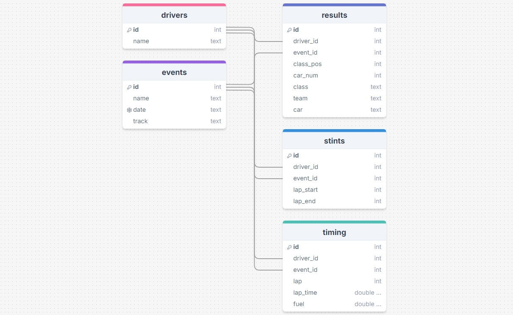
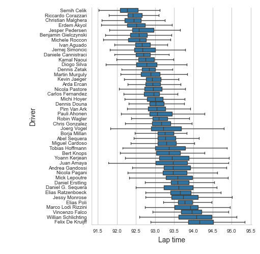

## Introduction

Parser extracts, transforms and saves data provided by the Virtual Endurance Championship (VEC).

VEC is one of the oldest sim racing championships that has been running for 17 years on rFactor simulator.

Packages used:
* pandas==2.2.3
* requests==2.32.3
* lxml==5.4.0
* html5lib==1.1
* beautifulsoup4==4.13.4
* matplotlib==3.9.2
* seaborn==0.13.2

## Data source 

Reports for all sessions are available here: https://simracing.live/results 

Select the series, season, division, round, session, click "Load results" and then "View full results" at the bottom of the page. The website will load html page with detailed results.

The HTML like looks like this: https://simracing.club/ResultsSystem/vec/s17/d1r1.html
* r - round
* d - division
* s - season
* vec - series

Both qualifying and race session results are included in the page.

## SQL database schema

The transformed data is stored in the SQLite database according to the schema below.

To start from scratch, run "create_tables.py" script. It deletes all data in "vec.sqlite" database and restores the schema.

## ETL process

The ETL process in managed by the "parse" function in the "parse_html.py" script. Refer to it for the detailed description.

For in-bulk parsing, you can easily generate html links for a specific season, division or series and pass them to this function in a loop.

Some pages have incomplete information and cause exceptions during parsing.

## Visualisation

The result is a nicely normalized and clean database ready for analysis.

"plot_pace.py" includes just one example with race pace visualisation for all drivers in GT3 class. You can edit and expand the script for your needs.

